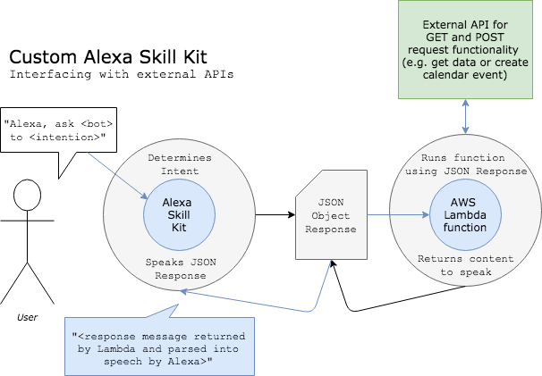

# *seeker*: A Destiny 2 player stats analytics project using Alexa

*seeker* is a Destiny 2 player statistics analytics project that seeks out useful info for users. The goal of this project is to enable Guardians to choose and equip their best gear for a given context and retrieve useful, real-time statistics about their gameplay. *seeker* drives a more data driven gaming experience with hands-free use of Alexa's voice user interface (VUI).

Do you play best with a long range sniper and an in-your-face submachine on the PvP map, Midtown? Do you rack up the most add kills with Riskrunner when there's an Arc modifier on Strikes? Let the data decide, and spend less time in your menu changing loadouts. 

## How it Works
*seeker* is integrated with Alexa as a downloadable custom skill which can be used on an Android phone or Echo device. You can use *seeker* to retrieve and use myriad player statistics from the Bungie API:
- Equip your best gear given your current activity with, **"Alexa, ask *seeker* to equip my best gear for this activity."**
- Shutdown an argument over which fireteam member has the best KDA with, **"Alexa, ask *seeker* what's my KDA."**
- Find out your highest score on your current activity and push yourself to beat it with, **"Alexa, ask *seeker* what's my best score on this map."**

## Behind the Scenes

## Resources
[Bungie API Docs for Destiny 2](https://bungie-net.github.io/multi/index.html)  
[Bungie API Repo on GitHub](https://github.com/Bungie-net/api)  
[gist for creating user session on Bungie.net](https://gist.github.com/ascendancyy/702db99b626d52d69359)  
[Alexa Skills Kit](https://developer.amazon.com/alexa-skills-kit)
